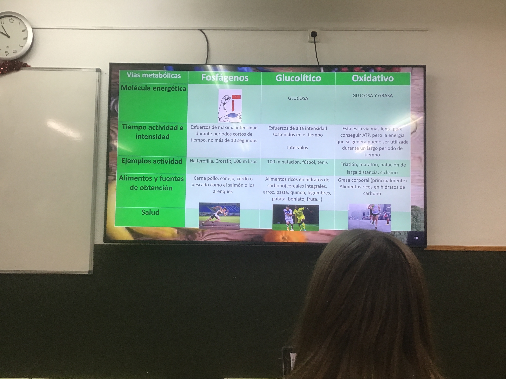

# Miércoles 22

## Charla sobre nutricion

- Clasificacion de nutrientes
    - Macronutrientes
        - Carbohidratos
        - Proteinas
        - Lipidos
    - Micronutrientes
        - Vitaminas
        - Minerales
        - Agua
    
- Consecuentcias de no beber agua
    - Dolor de cabeza
    - Infeccion de orina
    - Dolor de barriga
    - Fatiga mental
    - Baja el rendimiento deportivo
    
- Importancia de la hidratacion
    - Disminuye la capacidad de concentracion y toa de decisiones
    - Incremento de la temperatura coorporal
    - Aumento de la frecuencia cardiaca
    - Disminucioon del rendimiento fisico
    - Aparicion de calambres y contracturas
    - Aumento de riesgo de sufrir una lesion
    - Mayor riesgo de sufrir un golpe de calor o lipotimia
    
- Cunado bebo agua?
    - Al despertar (2)
    - Antes de hacer deporte (4)
    - Durante el deporte (3)
    - Antes de comer (2)
    - Durante las comidas (2)
    - En los descansos de clase (1)
    - CUANDO TENGA SED (5)
    

- Comida pre entreno
    - **Que es?** Es la comida que hacemos antes de realizar un tipo de actividad fisica
    - **Que debemos tomar antes de entrenar**
        - Hidratos de carbono (pan, pasta, arroz, quinoa, avena, garbanzos, lentejas, judias…)
        - Vitaminas y minerales (naranja , fresas, manzanas, etc)
- Comida post entreno
    - **Que es?**  es la comidad que hacemos despues de realilzar un tipo de actividad fisica
    - **Que debemos tomar despues de entrenar**
        - Hidratos de carbono (pan, pasta, arroz, quinoa, …)
        - Proteina (pollo, pavo, cerdo, ternera, pescado, …)
        - Grasas saludables (aguacate, alemndras, anacardos, nueces, AOVE, …)
        - Vitaminas y minerales (Naranjas, fresas, manzanas, platanos, …)
        
- Vias energeticas
    - ATP (adenosin trifosfato) “Moneda energetica”
    - Fosfagenos, glucolitico, oxidativo
    - PPP (Fosfatos, ribosa, adenia)
    

Tabla vias metabolicas

- Trastornos en la conducta alimentaria
    - **Que es?** Son trastornos psicologicos graves que conllevan alteraciones de la conducta alimentaria. La persona afectada muestra una fuerte preocupacion en la relacion al peso, la imagen corpora y la alimentacion, entre otros
    - **Curiosidades**
        - 1 de cada 5 jovenes corre el rieso de sufrir TCA
        - Es mas frecuente en mujeres aunque en hombres tambien es posible
        - Estos transtornos deben ser tratados por medicos especialistas.
        
- Anorexian nerviosa
    - Es un trastorno alimentario que causa que las personas pierdan mas peso de lo que se considera salidable apra su edad y estarua. Las personas con este trastorno pueden tener un miedo intenso a aumentar de peso, incluso cuando estan con peso insuficiente.
    - Miedo intenso a ganar peso
    - Distorsion de la imagen corporal o verse gorda a pesar de estar muy delgada
    - Reduccion del peso por debajo de los normal hasta llehar a malnutricion
    - Como consecuencia del adelgazamiento extremo aparecen algunos signos fisicos como piell seca y rugosa, caida del cabello, perdida de la menstruacion durante al menos 3 ciclos consecutivos
    - Sintomas psicopatologicos como estados de tristeza, angustia, irritabilidad o aislamiento social.
    - La personalidad de estas pacientes suele ser de perfeccionismo y de autoexigencia en sus vidad, que se acompaña de una baja autoestima.
    
- Bulilmia nerviosa
    - Es un trastorno alilmentario por e cual una persona tiene episodios regulares de comer una gran cantidad de alimento (atracones) durante los cuales siente una perdidad de control sobre la comidad. La persona ultililza luego diversas formas, tales como vomitar o consumir laxantes (purgase), para evitar el aumento de peso.
    - **Diferentes sintomas**
        - Atracones recurrentes
        - Episodios recurrentes de anorexia nerviosa
        - COnductas compensatoria inapropiadas
        
- Obesidad
    - La clasificacion internacional de la obesidad en adultos es la propuesta por la OMS y se basa en el Indice de Masa Corporal. Las personas que tienen un IMC igual o supoerior a 30kg/m2 (igual para ambos sexos), tienen obesidad.
    - **Tratamiento**
        - Educacion nutricional
        - Control regular del peso y fomentar otros parametros de saluld
        - Educacion en cuanto a deporte y actividad fisica
        - Terapia farmacologica
        - Terapia psicologia, aceptacion, autoestima
        - Hospitalizacion
        
- Menu
    - Plato saludable
    
    
    
    [Charla nutrición.m4a](https://drive.google.com/file/d/1x78b9P6hqZ55h0GNdWvIzYqo5lA3ICN7/view?usp=drivesdk)
